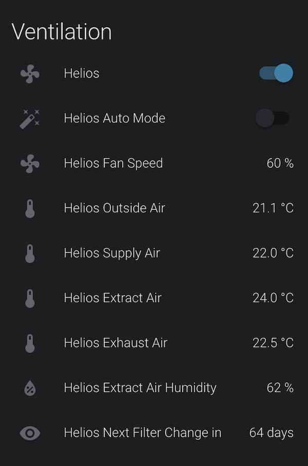
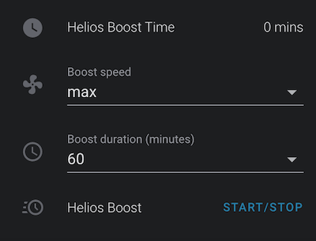

# homeassistant-helios

[](https://www.paypal.me/asev)

Custom component for Home Assistant to connect Helios ventilation system.

Tested on Helios KWL EC 300 W. Most functions will work on other Helios devices.



## Installation

1. Make sure your Helios has been connected to local network, and you know it's IP address.

2. Install **Helios ventilation** via HACS or copy the custom_components folder to your own Home Assistant /config folder.

3. Once Home Assistant has restarted, go to Configuration > Integrations.

4. Select the Helios integration and finish the setup.

Done. `fan.NAME` (default `fan.helios`) entity should be available in Home Assistant.

## Extra: Boost and Whisper modes

Ventilation speed might be changed for specific time period.
To do that use `helios.fan_boost` service with duration and speed fields.



Here is example how to have such boost with inputs on Lovelace.

```yaml
#configuration.yaml
input_select:
  helios_boost_speed:
    name: Boost speed
    options:
      - 'off'
      - low
      - medium
      - high
      - max
    icon: mdi:fan
  helios_boost_duration:
    name: Boost duration (minutes)
    options:
      - 10
      - 30
      - 60
      - 120
      - 240
      - 360
    icon: mdi:clock-outline
```

```yaml
#scripts.yaml
'ventilation_boost_toggle':
  alias: Ventilation Boost toggle
  sequence:
  - data_template:
      duration: >
        
          {{ states.input_select.helios_boost_duration.state }}
        
          0
        
      speed: '{{ states.input_select.helios_boost_speed.state }}'
    entity_id: fan.helios
    service: helios.fan_boost
```

```yaml
#ui-lovelace.yaml
      - type: entities
        entities:
          - entity: sensor.helios_boost_time
          - input_select.helios_boost_speed
          - input_select.helios_boost_duration
          - type: call-service
            service: script.ventilation_boost_toggle
            icon: mdi:clock-fast
            name: Helios Boost
            action_name: 'Start/Stop' 
```

## Feedback

Your feedback or pull requests or any other contribution is welcome. Please let me know how it works on other Helios models.
